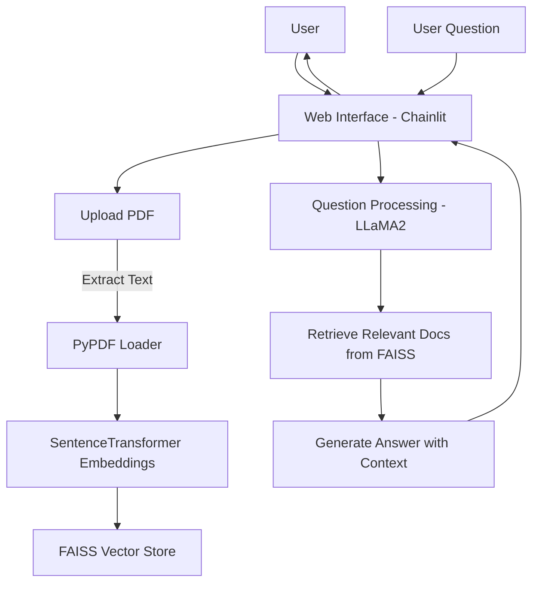

# 🧠 LLaMA2 Medical Chatbot – CPU Edition

The **LLaMA2 Medical Chatbot** is a tool designed to provide medical information by answering user queries using **state-of-the-art language models** and **dynamic document retrieval**. Users can upload their own medical PDFs, and the bot will instantly integrate them into its knowledge base — no restart required.

This version runs entirely on **CPU**, so it works on laptops without GPU support.

---

## 📑 Table of Contents

* [Introduction](#introduction)
* [Features](#features)
* [Architecture](#architecture)
* [Prerequisites](#prerequisites)
* [Installation](#installation)
* [Getting Started](#getting-started)
* [Usage](#usage)
* [Future Plans](#future-plans)
* [Contributing](#contributing)
* [License](#license)

---

## 📌 Introduction

The LLaMA2 Medical Chatbot is a **retrieval-augmented generation (RAG)** system that:

* Uses **LLaMA2** for language understanding.
* Retrieves relevant passages from uploaded PDFs using **FAISS vector search**.
* Runs **completely on CPU** for compatibility with most laptops.

---

## ✨ Features

✅ **Dynamic PDF Knowledge Base** – Upload new PDFs anytime, and the bot will instantly use them for answering questions.
✅ **Fast Semantic Search** – Uses embeddings for context-aware document retrieval.
✅ **CPU-Only Compatibility** – No GPU required; works on most personal machines.
✅ **Web-Based Interface** – Simple and interactive UI with **Chainlit**.

---

## 🏗 Architecture



**Explanation:**

1. User uploads PDFs → Text is extracted → Converted to embeddings → Stored in FAISS.
2. When the user asks a question, LLaMA2 retrieves relevant document chunks.
3. The model generates an answer using both the document context and its own knowledge.

---

## 📦 Prerequisites

* **Python 3.8+**
* Required Python packages (installed via `requirements.txt`):

  * `langchain`
  * `chainlit`
  * `sentence-transformers`
  * `faiss-cpu`
  * `pypdf` (for PDF loading)
  * `transformers` (for LLaMA2 model)
  * `torch` (CPU version)

---

## ⚙️ Installation

1. **Clone the repository**

```bash
git clone https://github.com/your-username/llama2-medical-chatbot.git
cd llama2-medical-chatbot
```

2. **Create and activate a virtual environment** (recommended)

```bash
python -m venv venv
venv\Scripts\activate  # Windows
source venv/bin/activate  # macOS/Linux
```

3. **Install dependencies**

```bash
pip install -r requirements.txt
```

4. **Download the LLaMA2 model**
   Follow the HuggingFace instructions for downloading LLaMA2 (you may need an access request).

---

## 🚀 Getting Started

1. Make sure your `.env` file contains any required keys (e.g., HuggingFace access token if using gated models).
2. Start the Chainlit app:

```bash
chainlit run model.py -w
```

3. Open the app in your browser at **[http://localhost:8000](http://localhost:8000)**.

---

## 💡 Usage

1. **Upload PDFs** – Drag and drop medical PDFs into the interface.
2. **Ask Questions** – Type a question in the chat; the bot retrieves relevant info from your uploaded documents.
3. **Get Contextual Answers** – The bot responds with an answer and may include references from your documents.

---

## 🔮 Future Plans

* 📷 **Medical Image Q\&A** – Interpret X-rays, MRIs, and other scans.
* ⚡ **GPU Acceleration Option** – Faster response times for large models.
* 📊 **Source Highlighting** – Show exactly where in the PDF the answer came from.

---

## 🤝 Contributing

Contributions are welcome!

1. Fork this repo.
2. Create a branch for your feature.
3. Submit a pull request with a clear explanation of your changes.

---

## 📜 License

This project is licensed under the MIT License.

---
